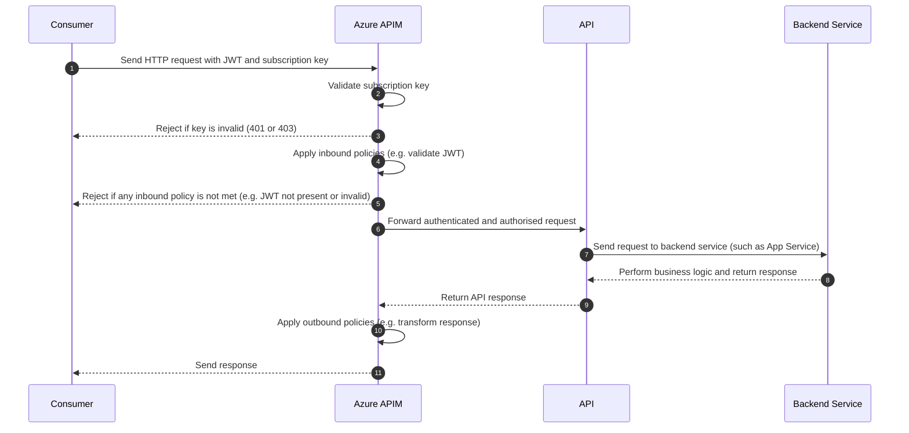

```mermaid
sequenceDiagram
   autonumber
   participant consumer as Consumer
   participant apim as Azure APIM
   participant api as API
   participant backend as Backend Service

   consumer->>apim: Send HTTP request with JWT and subscription key
   apim->>apim: Validate subscription key
   apim-->>consumer: Reject if key is invalid (401 or 403)
   apim->>apim: Apply inbound policies (e.g. validate JWT)
   apim-->>consumer: Reject if any inbound policy is not met (e.g. JWT not present or invalid)
   apim->>api: Forward authenticated and authorised request
   api->>backend: Send request to backend service (such as App Service)
   backend-->>api: Perform business logic and return response
   api-->>apim: Return API response
   apim->>apim: Apply outbound policies (e.g. transform response)
   apim-->>consumer: Send response
```
