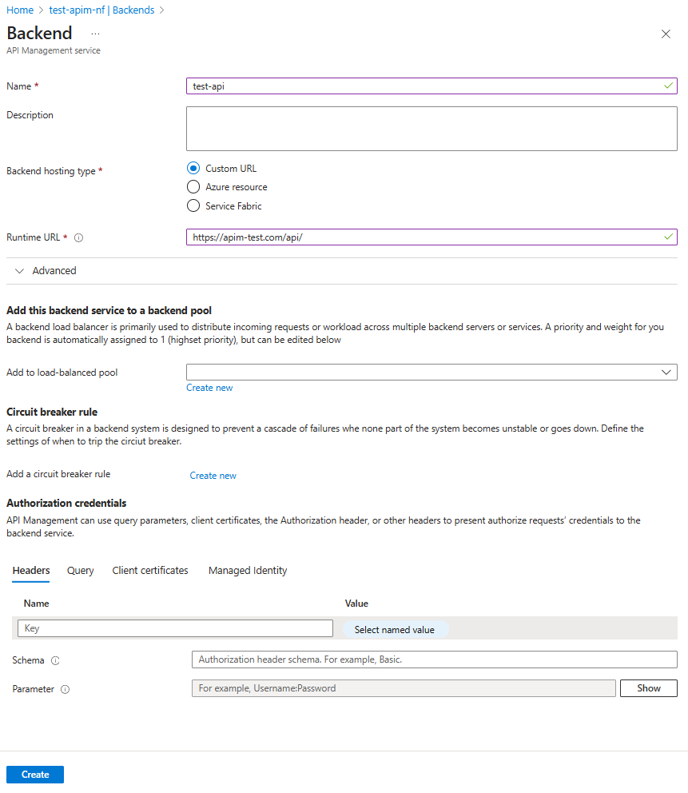
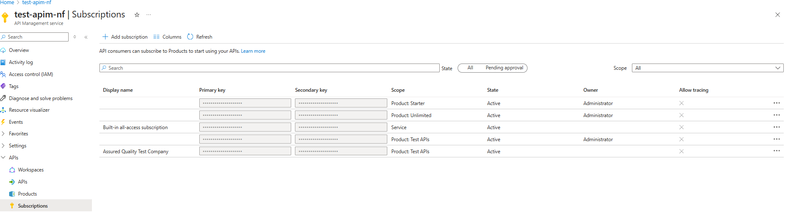
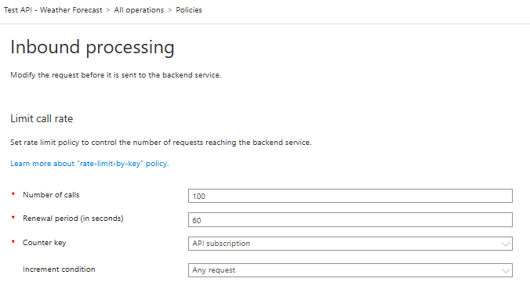

> ℹ️ This is a hands-on, surface-level overview of Azure APIM, based on my brief experience working with it as a developer.

## 🙋🏻‍♂️ What is Azure APIM?

Azure provides a management layer for cloud and on-prem APIs - this service is known as [Azure API Management](https://azure.microsoft.com/en-us/products/api-management).

## ❓ What Does Azure APIM do?

Azure APIM is essentially a front door to your APIs. Here are some of its useful features:

- Centralised authentication (layers of it)
- Validation and transformation of requests via policies
- Traffic-management via solutions such as rate-limiting, throttling
- API versioning
- Logging &amp; monitoring

## 📃 Key APIM Terms {#terms}

There are several terms used in APIM that I have been exposed to, so let's start by describing those:

**Backends** - Resources that represent the backend of your API. These are linked to APIs in APIM.

**APIs** - The APIs you want to manage via APIM.

**Products** - Allow grouping of APIs, subscriptions, and policies.

**Subscriptions** - Keys that are required by consumers to access products or APIs.

**Policies** - Set authentication requirements, modify incoming requests and outgoing responses. They can be set at root level, product level, or API level (even per operation).

**Policy Fragments** - Reusable, potentially parameterised policy sections.

## 🛞 A Typical Request Flow

Here is an example request sequence for APIM:


📸 **Picture this:**

You walk into a high-end restaurant (APIM). Your reservation is your JWT and subscription key. Your reservation is confirmed and your order is placed. Your meal is served.

Each step from entering the door to being served your meal mirrors how Azure APIM orchestrates a request:

1. The customer arrives with their reservation - a JWT and subscription key are presented to the front-of-house.
2. APIM (the head waiter) checks the reservation is in order (do they have a valid subscription key?).
3. If the booking isn't valid, they're turned away at the entrance (401 or 403).
4. Then, the head waiter requests their ID, confirming they match the reservation and meet entry requirements (JWT and other inbound policies).
5. No shirt, no shoes, no service. If the policy checks aren’t met, they won’t be seated.
6. If everything is satisfactory, the order is passed on to the kitchen (the API).
7. The kitchen sends the request to the chef (backend service).
8. The chef prepares the meal and sends it back to the kitchen staff (API).
9. The head waiter ensures the dish is up to standard - they might adjust the seasoning at this point (outbound policies).
10. The meal is served - the response is delivered to the consumer.

🍽️ Delicious.

## ⚒️ Setting it up in Azure Portal

Let's see how it looks by creating an API.

The API will have the following attributes:

- Use a backend service
- Belong to a product
- Require a subscription key from the consumer
- Require a JWT
- Limit call rate

### Azure APIM Overview

Azure APIM is laid out in the typical fashion of an Azure service, with the sidebar as navigation for different features.

Almost all of my experience with APIM as a developer has been in the APIs section.

All of the terms mentioned in [Key APIM Terms](#terms) are referenced in this section.


### Creating a Backend

Create a backend to point to the API service that is called by APIM.

_Backend hosting type_ allows three types:

- Custom URL - point to the URL of an API.
- Azure resource - point to a Function App, Logic App, or Web App (app service). Provides a dropdown list of Azure resources and requires the runtime URL.
- Service Fabric - point to a distributed service on Azure Service Fabric.

I've selected a custom URL to point to my pretend API.

_Runtime URL_ is the URL of the API that APIM will call.



The backend service has been created and now appears in the list of backends.


Next, we will add a product for the API to be included in.

### Creating a Product

We can create a product and publish it at a later date, but for the demo I have set it to published.

A product doesn't have to require a subscription. You might have APIs in your product that don't need to be locked down. In that case, you can apply a subscription on the _API level_.


The product has been created and now appears in the list of products.


This product requires subscriptions, so let's add a subscription key next.

### Adding a Subscription

A hypothetical consumer of the API is a company named **Assured Quality Test Company**.

We can create a subscription for the following scopes:

- All APIs
- API
- Product

I have created a subscription for the company, tied to the product created previously.


The subscription has been created and now appears in the list of products. The primary/secondary keys can now be provided to the consumer(s), and you can manage their subscriptions here.



Now we have a product and subscription keys, we can create an API and assign it to the product.

### Creating an API

APIs is where we define the APIs available in APIM.

We have several options to create an API definition.


I had trouble with the definition when I used App Service. It would just import a default set of definitions.

If you also face this issue, I would recommend selecting Create from definition - OpenAPI, and changing the backend service after.

For this demo, I have created from OpenAPI definition.

You can upload an OpenAPI specification, up to 4MB.

_API URL suffix_ is the suffix after the base URL of APIM, and before the controller/action.

I have added the API to the product in this screen. APIs can exist in multiple products.

I have also added versioning for the API. You can enable versioning via path, query, or header.


The API has now been created. The endpoints are loaded with all the information from the OpenAPI spec.


Next we will look at the settings and policies for the API.

#### API Settings

I've removed the _Web service URL_ to show how to point to the backend service.

_Subscription required_ needs to be enabled for APIM to check for subscription keys. Note the header name of the subscription key, as this will need to be passed in requests.

You can also set the authorisation for the API in _Security_. Setting it to OAuth 2.0 is the first step in validating the JWT.


Now let's set the backend service and rate-limiting for the API.

#### Setting up Policies

Click on the code tag in the backend service card (`</>`) and the policy editor will be displayed, showing the XML for all policies in the API.

I have removed the URL that the OpenAPI spec generated and added the following to inbound policies to set the backend service to the one created earlier:

```xml
<set-backend-service backend-id="test-api" />
```


Next we will add an inbound policy to limit the call rate for the API.

If we click on _Add policy_ in the _Inbound processing_ card, a list of policy templates will be displayed.


I have selected _Limit call rate_ for the API.

You can set the number of calls allowed per whichever interval you set.

You can set rate limits for IP addresses, subscriptions, or custom values, and increment the rate counter on 2xx codes, any requests, or custom values.



##### Subscription-Based Policy {#sub-policy}

You can set more than one rate limit policy, and it's possible to set it per subscription:

```xml
<choose>
    <when condition="@(context.Subscription.Id == 'sub-1')">
        <rate-limit calls="10" renewal-period="60" />
    </when>
    <when condition="@(context.Subscription.Id == 'sub-2')">
        <rate-limit calls="5" renewal-period="60" />
    </when>
    <otherwise>
        <rate-limit calls="2" renewal-period="60" />
    </otherwise>
</choose>
```

Now we can see the backend service and rate limit policies in the policy XML.


### Adding a JWT Policy to the Product

You might have noticed I didn't set up a policy to validate the JWT in the API.

You can apply policies for all products, all APIs, individual APIs, or API operations within an API.

By applying it at product level, every API in that product scope will require a JWT to be validated.

This saves time adding validation to each API, and the API can be used in another product that doesn't require the same JWT validation.

Back to the product page, we can see a tab for policies.


> ℹ️ An App Registration can be created to provide a managed identity for this product or API. This is out of scope for this overview, but a quickstart can be viewed [here](https://learn.microsoft.com/en-us/entra/identity-platform/quickstart-register-app).

I have created an inbound policy to validate the JWT using the tenant’s OpenID configuration URL.

The consumer would obtain a JWT from the app registration using a client ID and secret. The JWT would contain the API URL for the app registration in its audience claim.

You can also change the status code or message of the response.


Now the consumer can generate a request for the API with its access token and subscription key.

Here is an example Powershell script to test it (an API client would be more common):

```powershell
$apiUrl = "https://test-apim-nf.azure-api.net/v1/WeatherForecast"
$subscriptionKey = "subscription-key-value"
$accessToken = "jwt-value"

$headers = @{
    "Ocp-Apim-Subscription-Key" = $subscriptionKey
    "Authorization" = "Bearer $accessToken"
}

$response = Invoke-RestMethod -Uri $apiUrl -Method Get -Headers $headers

$response | ConvertTo-Json
```

## 🧩 Understanding Policy Fragments

Policy fragments are simply reusable snippets of XML that can be added to other policies.

> 🚫 You can't use fragments inside other fragments.

The [rate-limiting policy](#sub-policy) created earlier is a good candidate for a policy fragment.

If the rate limit for the two subscriptions needed to be implemented across several APIs or products, it could easily be implemented and edited across them all as a policy fragment.

The definition for the policy fragment `RateLimitForSub1And2` would be:

```xml
<fragment>
  <choose>
    <when condition="@(context.Subscription.Id == 'sub-1')">
        <rate-limit calls="10" renewal-period="60" />
    </when>
    <when condition="@(context.Subscription.Id == 'sub-2')">
        <rate-limit calls="5" renewal-period="60" />
    </when>
  </choose>
</fragment>
```

Implementing it in a policy is as simple as including the fragment ID:

```xml
<inbound>
    ...
    <include-fragment fragment-id="RateLimitForSub1And2" />
</inbound>
```

## 📕 Wrapping Up

I have also used the Test tab in the API page, but that's pretty self-explanatory (just ensure you disable CORS - next to the _run_ button, if required).

That's about as much as I've experienced so far in Azure APIM.

Having APIM handle authentication, request validation, and enforcement of policies like rate-limiting and subscription filtering saves time and effort on the not-so-interesting aspects of developing an API.

With APIM handling these concerns, I was able to focus on writing the business logic instead of boilerplate code, and the code is much simpler as a result.
