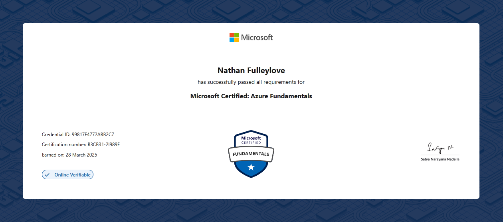
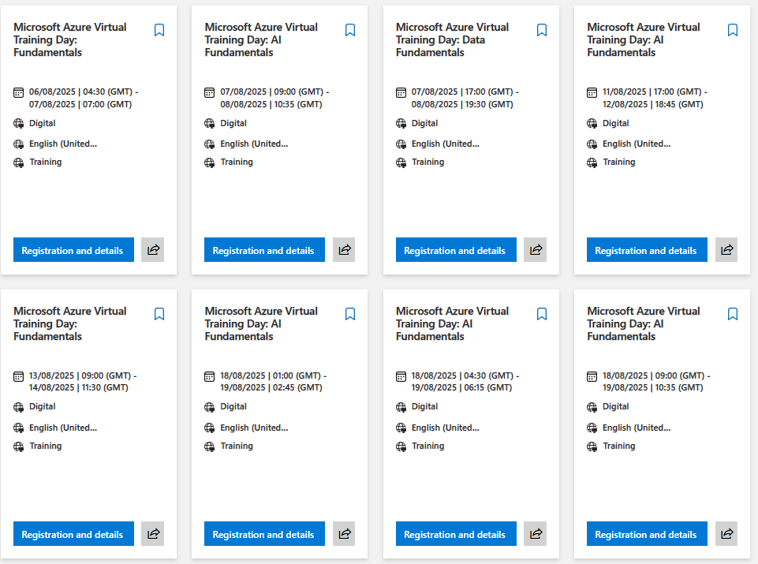
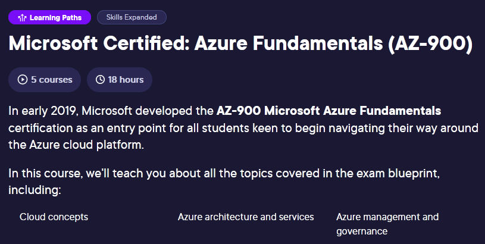

## 🕒 It's Been a While...

Almost nine years since my last certification (70-461 - Querying Microsoft SQL Server 2012/2014), and I decided to study for the AZ-900 to learn about the different cloud services provided by Azure.

## 🚀 My AZ-900 Journey

One of the main focuses in my current role is cloud development and migrating existing apps to the cloud. I felt that becoming cloud-certified would be a great way to learn about the different tools and concepts that will allow me to make a greater impact.

I decided to start my journey towards cloud-certification by completing the AZ-900 exam.

### First Steps

The AZ-900 is a fundamentals exam, so I didn't expect it to be very difficult. Still, I needed to commit to it and study effectively.

The first thing I looked at were the [skills measured](https://learn.microsoft.com/en-gb/credentials/certifications/resources/study-guides/az-900#skills-measured-as-of-january-23-2024).

> - Describe cloud concepts (25–30%)
> - Describe Azure architecture and services (35–40%)
> - Describe Azure management and governance (30–35%)

Looking at the breadth of this exam, it was clear I wouldn't be booking it for the following week.

I set myself a target exam date just over four weeks away (conveniently preceding drinks with former colleagues). 🍻

### Study Materials

There are many options when studying for the AZ-900. I've recommended [MS Learn](https://learn.microsoft.com/en-us/credentials/certifications/azure-fundamentals) to several developers for Azure learning material. However, for this exam, I used the following:

#### Microsoft Virtual Training Days

One thing not everyone is aware of is [Microsoft Virtual Training Days](https://events.microsoft.com/en-us/mvtd).

Not only are these training days good learning resources (if you appreciate presentations), they also provide a discount for the exam upon completion (up to 50% in my experience).

#### Pluralsight

Most of my study hours were spent consuming [Pluralsight's AZ-900 course](https://www.pluralsight.com/paths/microsoft-certified-azure-fundamentals-az-900). All 18 hours of it.

The labs were particularly useful, and they even include a practice exam for business plans.

### Exam Day

I completed some practice questions whilst on the train to the test centre. I didn't want to do too much practice around exam day, I was just warming up.

Once I was seated at the test centre, I began the exam. ⏱️

I skipped the introductory parts, as I'm familiar with the testing software and exam structure. Microsoft provide details on the exam experience [here](https://learn.microsoft.com/en-us/credentials/support/exam-duration-exam-experience).

You are given 45 minutes to complete the exam, but I completed it much sooner than that.

The wording of the questions was my biggest concern, as there were a few questions that were difficult to comprehend, grammatically.

The pass mark is 700 out of 1000, so I'd be happy as long as I got 700 or more.

I clicked the button to end the exam and waited for the results. The moment between ending the exam and waiting for the result is always enjoyable.

And if you hadn't guessed... Pass! ✅ I was happily surprised with a score of 889.

## 🛣️ What's Next?

I'm aiming to study towards the AZ-204 and become an [Azure Developer Associate](https://learn.microsoft.com/en-us/credentials/certifications/azure-developer), but I would like professional experience with more of the services featured in that exam first.

For now, I will be working on personal projects. I'm currently working on a mobile app for birthday reminders.

## 📝 Final Words

I would recommend the AZ-900 to anyone that is looking to understand Azure, including the services it provides and cloud concepts in general.
