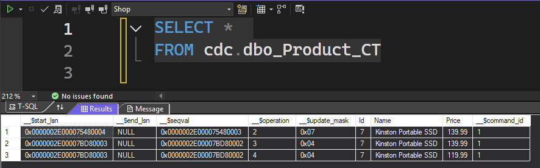
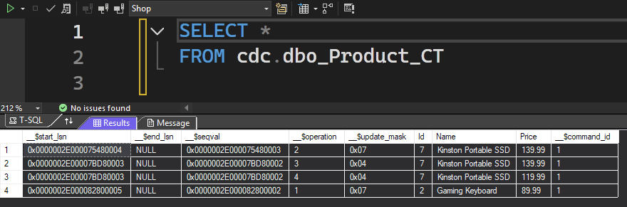
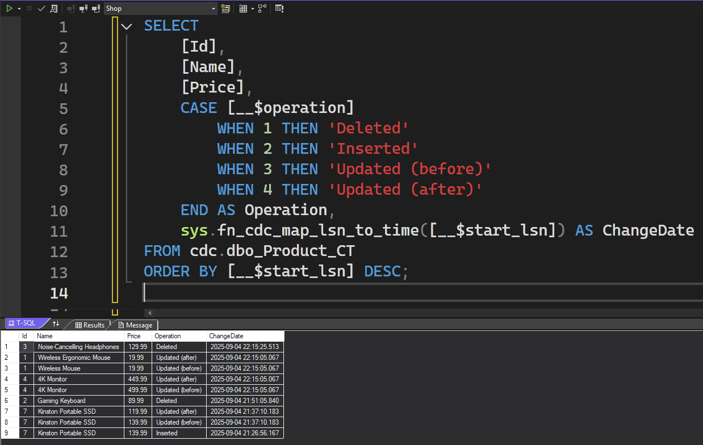

> ⚠️ CDC is available for Enterprise, Enterprise Evaluation, Developer, and Standard editions of SQL Server.

In a recent project, I was tasked with displaying changes to specific fields within a database.

During my research, I discovered Change Data Capture (CDC) for SQL Server, and it has proven to be a very effective solution for tracking changes to table data.

This post explains CDC and its benefits, how it works, and a step-by-step guide to set it up.

## ❓ What is CDC?

CDC is a feature in SQL Server that tracks changes to table rows. Whether a row is inserted, updated, or deleted, CDC captures it all.

It can track changes for an entire table or specific fields within a table.

It can be used for auditing, ETL operations, and data-warehousing.

## 🤔 Why use CDC?

Here are four benefits:

### Efficient Change Tracking

Changes are captured asynchronously, improving performance compared to triggers.

### Simplified Data Replication

Change tables and functions are automatically created, making it easier to replicate data changes to other systems.

### Comprehensive Tracking

All types of changes are tracked - including inserts, updates (before _and_ after), and deletes. This provides a complete picture of data modifications.

### Configurable Retention Period

It's possible to set the retention period for change data, giving you control over how long the tracked data is kept. This is set at the database level.

## ⚙️ How does CDC work?

### Transaction Log Monitoring

CDC monitors the transaction log to capture changes made to tables. This is achieved via SQL Server Agent jobs.

### Change Tables

Changes are recorded in change tables which mirror the source tables.

### Query Functions

CDC provides functions to query the changes, allowing apps to retrieve changes over specified date ranges.

### Capture Instances

Each tracked table can have up to two capture instances, which includes the change table and query functions.

## 🎬 Demo

In this demo, we'll enable CDC on a database and table, capturing changes for several columns.

### Scenario

Our company has a database named `Shop` which has a `Product` table containing the products for the shop.

They want to audit price changes for products and notify Marketing of any discounted products.

The `Product` table is defined below:

| Field       | Data Type       |
| ----------- | --------------- |
| Id          | `int`           |
| Name        | `nvarchar(100)` |
| Description | `nvarchar(255)` |
| Price       | `decimal(10,2)` |

It currently contains 6 rows:

| Id  | Name                        | Description                                             | Price  |
| --- | --------------------------- | ------------------------------------------------------- | ------ |
| 1   | Wireless Mouse              | Ergonomic mouse with adjustable DPI and silent clicks   | 19.99  |
| 2   | Gaming Keyboard             | Mechanical RGB keyboard with customizable macros        | 89.99  |
| 3   | Noise-Cancelling Headphones | Over-ear headphones with active noise cancellation      | 129.99 |
| 4   | 4K Monitor                  | 27-inch UHD monitor with HDR and 144Hz refresh rate     | 499.99 |
| 5   | USB-C Hub                   | 7-in-1 hub with HDMI, USB 3.0, and SD card reader       | 39.99  |
| 6   | LED Desk Lamp               | Dimmable lamp with touch controls and USB charging port | 24.99  |

### Enabling CDC on the Database

> ⚠️ To enable CDC on a database and tables, you need `sysadmin` permissions.

> ⚠️ Ensure the SQL Server Agent is running.

The following SQL will enable CDC on the database:

```sql
EXEC sys.sp_cdc_enable_db;
```

Ensure that you are in the correct database before you execute it.



To disable CDC for the database, use the following SQL:

```sql
EXEC sys.sp_cdc_disable_db;
```

### Enabling CDC on the Table {#enable-cdc-table}

The following SQL will enable CDC on the table:

```sql
EXEC sys.sp_cdc_enable_table
    @source_schema = N'dbo',
    @source_name = N'Product',
    @role_name = NULL,
    @captured_column_list = N'Id,Name,Price';
```

The first three parameters of the `sp_cdc_enable_table` stored procedure are required.

- `source_schema` is the schema of the table.
- `source_name` is the name of the table
- `role_name` is a database role that limits access to change data. By setting it to null, no limits are set.
- `captured_column_list` is an optional comma-separated list of fields that you wish to track changes for. If not included, all fields will be tracked.

> ⚠️ When using the `captured_column_list`, columns used to uniquely identify a row must be included (typically the PK).



In this example, CDC has been enabled on the `Product` table, and any changes to the `Id`, `Name`, or `Price` fields will be tracked.

To disable CDC on a table, use the following SQL:

```sql
-- Find the name of the capture instance
EXEC sys.sp_cdc_help_change_data_capture;

EXEC sys.sp_cdc_disable_table 'dbo', 'Product', 'dbo_Product';
```

### What Happens When Enabling CDC?

We have now enabled CDC on the database and the table. So what has changed?

The SQL Server Agent has added two jobs:

- `cdc.Shop_capture`
- `cdc.Shop_cleanup`

These jobs capture the changes by monitoring the transaction log, and clean up the capture table based on its retention period.

The default retention period for change tables is 3 days. You can change this (up to 100 years!) by executing the following SQL in the CDC-enabled database:

```sql
EXECUTE sys.sp_cdc_change_job
    @job_type = N'cleanup',
    @retention = 10080; -- 7 days in minutes
```

In the database, the `cdc` schema has been added, and several system tables:

- `captured_columns` is the list of captured columns for each table with CDC enabled.
- `change_tables` is all of the tables with CDC enabled.
- `dbo_Product_CT` stores the changes (inserts, updates, deletes) for the table.
- `ddl_history` is the DDL history for change tables.
- `index_columns` is the uniquely-identifiable columns for a change table (`Id` in `Product` case).
- `lsn_time_mapping` is used to convert dates of changes to human-readable forms.

Next, we'll add and modify data, observing the behaviour as we progress.

### Inserting a Product

Let's insert a row into the table.

```sql
INSERT INTO [Product]
(
	[Name],
	[Description],
	[Price]
)
VALUES
(
	N'Kinston Portable SSD',
	N'2TB external SSD',
	139.99
);
```



The `Id`, `Name`, and `Price` columns are tracked, so we should see a change in the change table.

We can query the change table directly, via the following SQL:

```sql
SELECT *
FROM cdc.dbo_Product_CT
```



We can see a row has been inserted into the change table.

### Updating a Product

Now we'll update one of the captured fields for the inserted product and check that the update was tracked.

```sql
UPDATE [Product]
SET [Price] = 119.99
WHERE [Id] = 7;
```

As the Price field is tracked, two rows have been inserted into the change table:

- One that represents the data before the update.
- One that represents the data after it.



### Updating an Uncaptured Field for a Product

As the `Description` field isn't in the list of captured columns set in [Enabling CDC on the Table](#enable-cdc-table), this change shouldn't be recorded in the change table.

```sql
UPDATE [Product]
SET [Description] += N' with free backup software (3 month trial)'
WHERE [Id] = 7;
```



### Deleting a Product

Finally, we'll delete an existing product.

```sql
DELETE FROM [Product]
WHERE [Id] = 2;
```



The gaming keyboard existed before we enabled CDC on the table.

However, changes to all rows in the table are now captured.

### Overview of the Change Table

The main fields in the change table are:

- The fields relating to the product.
- `__$start_lsn`: The log sequence number (LSN) where the change/transaction began.
- `__$end_lsn`: The LSN where the transaction ended.
- `__$operation`: The type of change that occurred.

The LSNs can be converted into dates.

`__$operation` has four values:

- 1: Deleted
- 2: Inserted
- 3: Updated (before)
- 4: Updated (after)

#### Improving the Change Table Query

The following SQL shows the latest changes in the change table, with readable dates and clearly defined operations:

```sql
SELECT
	[Id],
	[Name],
	[Price],
    CASE [__$operation]
        WHEN 1 THEN 'Deleted'
        WHEN 2 THEN 'Inserted'
        WHEN 3 THEN 'Updated (before)'
        WHEN 4 THEN 'Updated (after)'
    END AS Operation,
    sys.fn_cdc_map_lsn_to_time([__$start_lsn]) AS ChangeDate
FROM cdc.dbo_Product_CT
ORDER BY [__$start_lsn] DESC;
```

As we can see, with multiple changes, we can see a clear timeline of changes for any products:



You could easily filter this query by operation or date.

## 🛣️ What Next?

There is now an audit trail for products. The history of a product's price could be analysed in a separate UI.

The changes could easily be pushed to other systems, if the data needed to be synchronised.

Teams could be alerted when a product is renamed or repriced.

In my instance, I migrated the change data to permanent tables to ensure the historic data is stored beyond the retention period.

## 📘 Further Reading

For more in-depth information on Change Data Capture (CDC), Microsoft provides detailed documentation:

[What is change data capture (CDC)? - MS Learn](https://learn.microsoft.com/en-us/sql/relational-databases/track-changes/about-change-data-capture-sql-server?view=sql-server-ver17)
